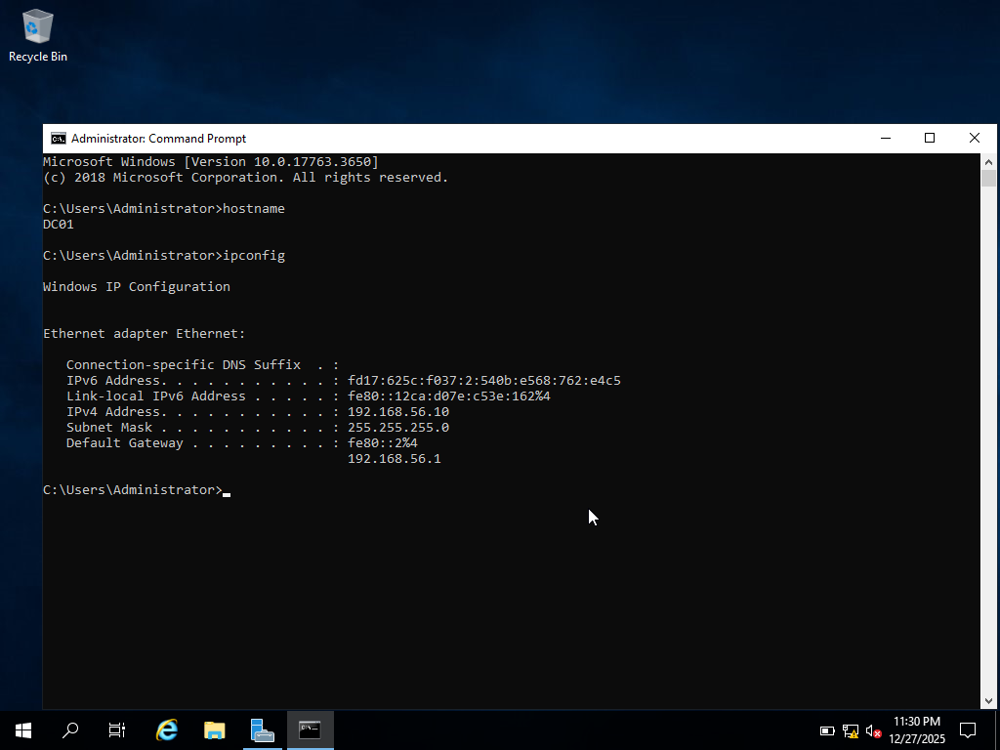
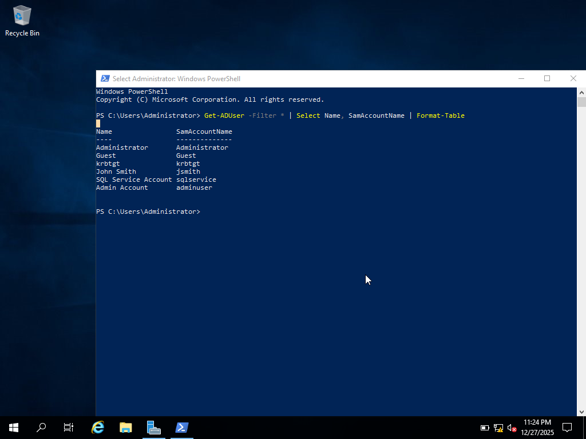
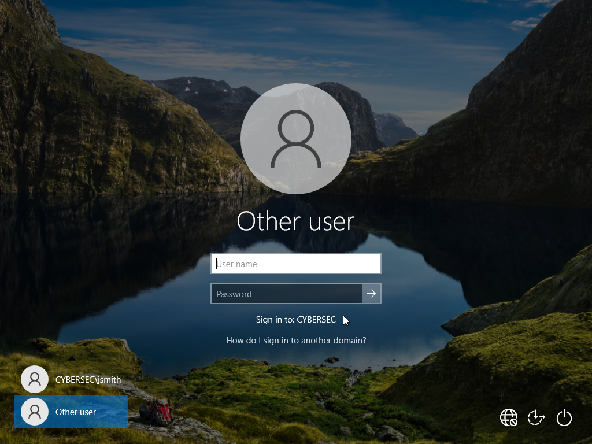
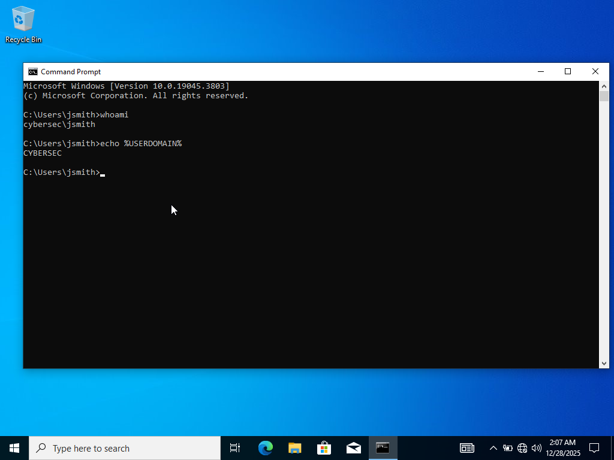
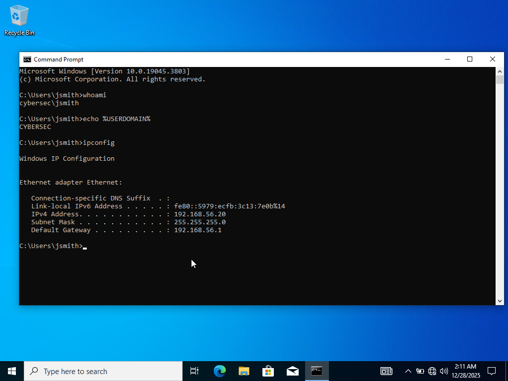
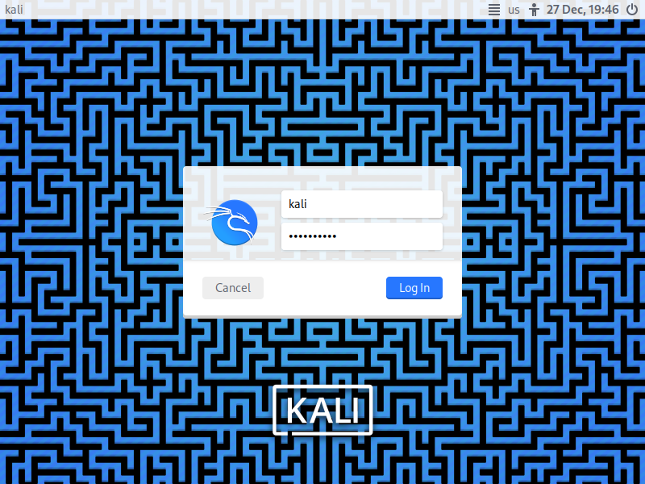
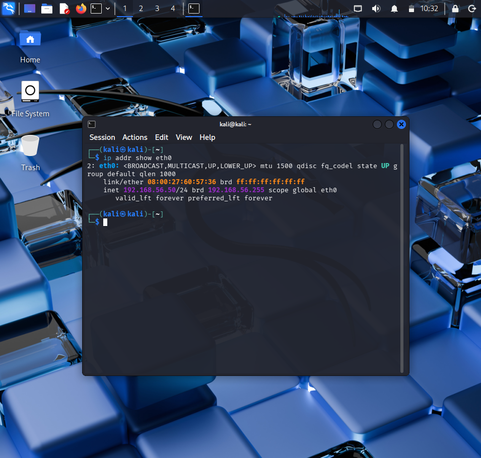
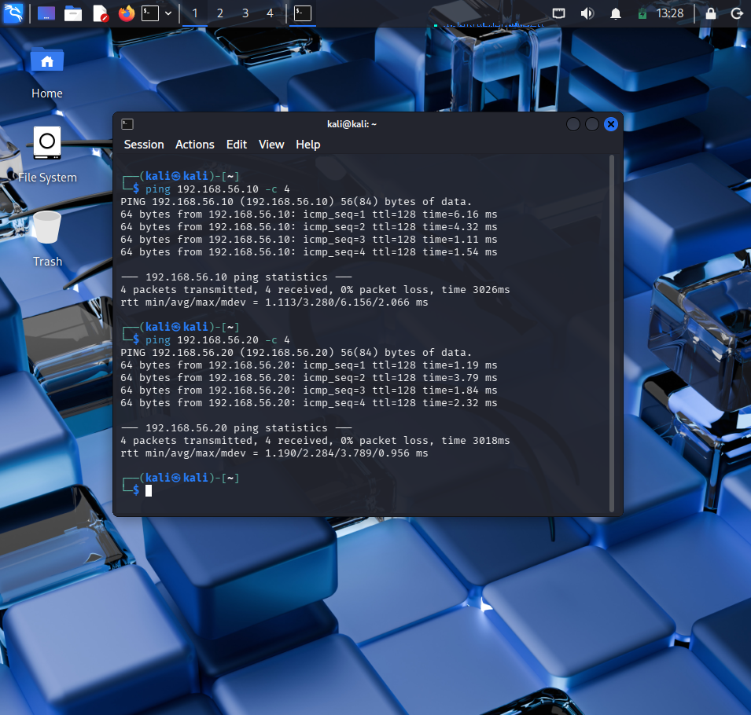

# 🛡️ Active Directory Security Lab

## 📋 Overview
Built a complete Active Directory environment from scratch to learn enterprise networking, Windows Server administration, and security fundamentals.

## 🏗️ Lab Architecture

| System | Role | IP Address | OS |
|--------|------|------------|-----|
| **DC01** | Domain Controller | 192.168.56.10 | Windows Server 2019 |
| **CLIENT01** | Domain Workstation | 192.168.56.20 | Windows 10 Pro |
| **KALI** | Security Testing | 192.168.56.50 | Kali Linux |

**Domain:** `cybersec.local`  
**Network:** Internal VirtualBox network (Host-Only Adapter)

## ✅ What I Built

### Phase 1: Domain Controller Setup
- ✅ Installed and configured Windows Server 2019
- ✅ Deployed Active Directory Domain Services (AD DS)
- ✅ Created domain: `cybersec.local`
- ✅ Configured DNS service for domain name resolution
- ✅ Set up DHCP for IP address management
- ✅ Created organizational units (OUs) and user accounts

### Phase 2: Client Integration
- ✅ Deployed Windows 10 Pro workstation
- ✅ Successfully joined CLIENT01 to the domain
- ✅ Tested user authentication (domain login)
- ✅ Verified network connectivity and DNS resolution

### Phase 3: Security Testing Platform
- ✅ Installed Kali Linux with penetration testing tools
- ✅ Configured static IP and network settings
- ✅ Established connectivity to domain network
- ✅ Prepared environment for security testing

## 📸 Documentation

### 1. Domain Controller Setup

### 2. Active Directory User Management

### 3. Client Domain Join

### 4. User Authentication

### 5. Client Network Configuration

### 6. Kali Linux Installation

### 7. Kali Network Configuration

### 8. Network Connectivity Testing

## 🛠️ Technologies & Tools

**Infrastructure:**
- Oracle VirtualBox (Virtualization)
- Windows Server 2019 (Domain Controller)
- Windows 10 Pro (Client Workstation)
- Kali Linux 2024 (Security Testing)

**Services Configured:**
- Active Directory Domain Services (AD DS)
- Domain Name System (DNS)
- Dynamic Host Configuration Protocol (DHCP)

**Skills Applied:**
- Virtual machine deployment and networking
- Windows Server installation and configuration
- Active Directory administration
- DNS and DHCP configuration
- Domain joining and user authentication
- Network troubleshooting
- Security lab environment setup

## 📚 Key Learnings

- **Active Directory Fundamentals:** Understanding domain structure, organizational units, and user/group management
- **Windows Networking:** DNS, DHCP, and how domain authentication works in enterprise environments
- **Virtualization:** Creating isolated network environments for testing
- **Troubleshooting:** Resolved network connectivity and domain joining issues
- **Security Mindset:** Built foundation for understanding attack/defense in AD environments

## 🎯 Project Purpose

This lab was built to:
1. Gain hands-on experience with enterprise Windows infrastructure
2. Understand how Active Directory works in real-world environments
3. Create a safe testing environment for learning security concepts
4. Develop troubleshooting and problem-solving skills
5. Build a portfolio piece demonstrating technical capabilities

## 🚀 Future Enhancements

Potential next steps for this lab:
- Implement Group Policy Objects (GPOs) for security hardening
- Simulate common AD attacks (Kerberoasting, Pass-the-Hash)
- Deploy Windows Event Forwarding for centralized logging
- Add additional domain controllers for redundancy
- Practice incident response scenarios

---

**Author:** Muhammad Omar  
**Date Completed:** December 2024  
**Time Invested:** 10 days of hands-on learning  

*This project demonstrates the ability to design, deploy, and document enterprise infrastructure from scratch.*
